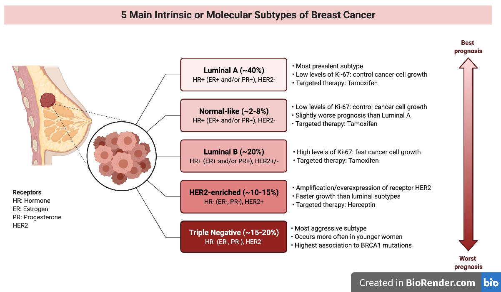
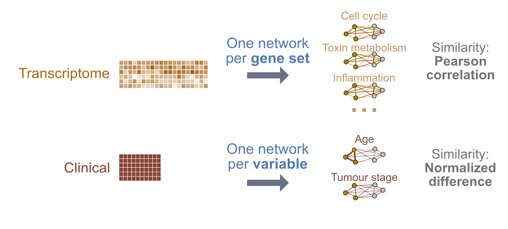

# Introduction

This book contains lab exercises for Module 11: Multi-modal Data Integration, as part of the [Canadian Bioinformatics Workshop Cancer Analysis (CAN) Workshop](https://bioinformatics.ca/workshops/2021-cancer-analysis/).

## Course materials

You can [download course slides here](https://drive.google.com/file/d/1om3f86m3h8NWyCGHnim2mgFdc_n5Ym7M/view?usp=sharing)

We will have two lab exercises, where we build patient classifiers using multi-modal data integration, using netDx [@Pai2019-iu; @Pai2021-um]. 

## Data

<style>
p.caption {
  font-size: 0.6em;
}
</style>

For both lab exercises, we will use multi-modal breast cancer data from The Cancer Genome Atlas [@noauthor_2012-nc], and classify tumours by molecular subtypes originally defined using gene expression profiles. 

In particular, we will focus on classifying tumours as being of either *Luminal A*, *Luminal B*, or *Basal-like* subtypes. These subtypes vary by prevalence, prognosis for survival and relapse, activated cellular signaling pathways, immunohistochemical markers and treatment options [@Yersal2014-km]. 

```{r,echo=FALSE,fig.cap="Reprinted from [Intrinsic and Molecular Subtypes of Breast Cancer](https://app.biorender.com/biorender-templates/figures/5f15ea4438c5ef002876ab4b/t-5f872409fb2c3900a82e109e-intrinsic-and-molecular-subtypes-of-breast-cancer), by BioRender, October 2020, Copyright 2021 by BioRender."}

```

This dataset was selected because it has characteristics of a common use cancer in cancer genomics:

* There are pre-defined subtypes discovered using class discovery approaches (unsupervised methods such as clustering) OR defined by the clinical problem
* Subtypes are correlated with differences in clinical outcome and choice of treatment 
* For the purposes of this lab, it is instructive to use subtypes with known cellular signaling pathways


## Labs

### LAB 1: A gentle introduction 

We will classify breast tumours as being one of three subtypes: Luminal A, Luminal B, and Basal-like. For this we will build a **three-way classifier** by integrating four types of -omic data: gene expression, miRNA, DNA methylation and proteomics. The design will be simple, using a single patient similarity network (feature) created from each layer. Similarity will be defined as pairwise Pearson correlation of profiles. Each network will use all measures from a given -omic data type (no filtering or grouping). 

```{r,eval=TRUE, echo=FALSE}
knitr::include_graphics("images/Lab1_design.jpg")
```

### LAB 2: Pathway features & custom similarity metrics

We will build a **binary classifier** of breast tumour subtype using gene expression and clinical data, but will use a slightly more complex design. We will define features at the *pathway level* for gene expression, so we can score pathways by their ability to predict outcome. With clinical data, we will define features at the level of *individual clinical variables* (e.g. age). We will also introduce the idea of using custom similarity metrics.

```{r,eval=TRUE,echo=FALSE}

```

## Instructions
* Labs will use **Rstudio**.
* Each lab will be provided as blocks of R code you will copy-paste into Rstudio to follow the building of the predictor. Code blocks to be pasted will be in yellow like so.

```{r,class.source="codeblock",eval=FALSE}
x <- 5
```
If you hover your mouse over the block, you should see a little clipboard icon. Clicking on that icon will allow you to copy the block in one shot. I would use that.

In each case, the result of executing a code block is shown directly after the code, in grey blocks like the one below. These are not intended to be pasted in. 

```{r,eval=FALSE}
5
```

Sometimes we show "pseudocode" or conceptual code blocks; these will also be in grey. None of these are intended to be pasted in.
```{r,eval=FALSE}
# do not paste me in!
loop_over (all my patients){
    do something useful;
}
```

That's about it! 

Let's go!

## Post-script: Installing netDx on your own laptop

You will need:

* [Java](https://java.com/en/download/help/download_options.html)
* [Cytoscape](https://cytoscape.org/) with the apps EnrichmentMap and Auto Annotate installed
* On Unix: 
```{eval=FALSE}
$ sudo apt-get update
$ sudo apt-get install libxml2 zlib1g-dev libglpk40
 ```

* In `R`, install the following packages:
```{r,eval=FALSE}
# install BioConductor
if (!requireNamespace("BiocManager", quietly = TRUE))
    install.packages("BiocManager")
BiocManager::install(version = "3.13") # could need 3.12 if R < 4.1

# install R dependencies
install.packages(c("ROCR", "pracma", "ggplot2", "glmnet", 
  "igraph", "reshape2", "bigmemory", "doParallel", 
  "foreach", "combinat", "rappdirs", "RColorBrewer", 
  "Rtsne", "rmarkdown"))

# install BioConductor dependencies
BiocManager::install(c("RCy3", "biomaRt", "MultiAssayExperiment", 
  "curatedTCGAData", "TCGAutils", "BiocFileCache", 
  "GenomicRanges", "GenomeInfoDb", "IRanges", 
  "scater", "clusterExperiment", "netSmooth",  
  "BiocStyle","Rtsne"))

BiocManager::install("netDx")
```
