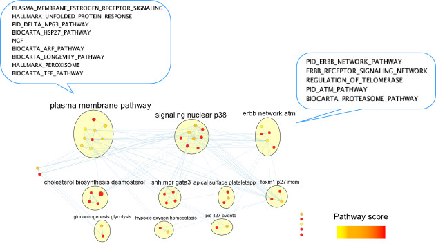

# Module 11 Lab 2: Pathway-level features

**This work is licensed under a [Creative Commons Attribution-ShareAlike 3.0 Unported License](http://creativecommons.org/licenses/by-sa/3.0/deed.en_US). This means that you are able to copy, share and modify the work, as long as the result is distributed under the same license.**

## Introduction
In this example, we will learn how to:

* Use custom similarity metrics
* Group variables into biologically-meaningful units such as pathways, for improved interpretability

Here, we will again use breast cancer samples, and discriminate between Luminal A, Luminal B and basal-like tumours. We will limit ourselves to clinical data and gene expression data but will make the following design changes:

 * Clinical variables: A feature (or patient similarity network;PSN) will be defined at the level of selected  *variables* (e.g. age); we will define similarity as *normalized difference*. 
 * Gene expression: Features will be defined at the level of ***pathways***; i.e. each feature groups only those genes corresponding to the pathway. Similarity is defined as pairwise *Pearson correlation*.

```{r, class.source="codeblock",echo=FALSE, fig.cap="Lab 2 design: We will integrate clinical and gene expression data. Each layer will be converted into a single patient similarity network using Pearson correlation for pairwise similarity.", echo=FALSE}
knitr::include_graphics("images/Lab2_design.jpg")
```

```{block type="rmd-design"}
 1. In practice I recommend running a predictor design with 2-3 different sets of pathway definitions, and comparing the predictive pathway themes. For instance, it could be useful to compare results from using all curated pathways, to just domain-specific ones.  
 Feature design is something of an art, and the choice of pathways depends on what your goals with building the predictor are. Are you looking to prioritize a known set of biological processes or interested in general discovery? These are tradeoffs. 
 At the very least I would recommend running with all curated pathways as a baseline, because you may generate novel hypotheses.  

 2. Note that while in this design we group gene expression measures into pathways, the same design can be used to group other types of data based on prior knowledge. For instance, measures from imaging data could be grouped by prior knowledge of correlated networks of regions of interest subserving specific functions. 
 
 ```
 
## Get and prepare data

Let's fetch the BRCA data using `curatedTCGAData` again, this time only the gene expression data. Remember, the clinical data we automatically get in the `colData()` slot returned.


```{r, class.source="codeblock", class.source="codeblock",eval=TRUE}
suppressMessages(library(curatedTCGAData))
brca <- suppressMessages(
   curatedTCGAData(
	   "BRCA",c("mRNAArray"),
	   dry.run=FALSE)
	)
```

Let's look at the data. Notice that we now only have one -omic assay, gene expression measures from microarrays.

```{r, class.source="codeblock",eval=TRUE}
brca
```

As before, we prepare the data. I highly recommend separating the script that prepares the data from the one running the predictor for improved management, readability and debuggability.

```{r, class.source="codeblock",eval=TRUE}
source("prepare_data.R")
brca <- prepareDataForCBW(brca, setBinary=TRUE)
```

## Create feature design rules
Load the `netDx` package and initialize the `groupList` object, where we will store our grouping rules.
Recall that `groupList` is a list-of-lists, with the top tier containing data layer names, and that the layer names must match `names(assays(brca))` or whatever your `MultiAssayExperiment` object is called.

```{r, class.source="codeblock",eval=TRUE}
suppressWarnings(suppressMessages(require(netDx)))
groupList <- list()
```

### RNA: Pathway features

Let's group genes into *pathway-level features*, i.e. instead of one PSN for transcriptomic data, we create one PSN for each *pathway*. So if you had a pathway set with 2,000 curated pathways, **this would generate 2,000 input PSN**. 


```{block,type="rmd-caution"}
This design changes model-building time to several hours, so avoid large gene sets (e.g. the full set of ~44,000 Gene Ontology terms, or even ~29,000 GO Biological Process terms). A reasonable start is a compilation of pathways from all curated pathway databases, as in below. 
Whichever list you use can be pruned by constraining the min/max number of genes in a set, but the size is something to keep in mind.
```

There are two ways of providing pathway data to netDx:
1. You can **download** a compilation of pathways from curated databases using the `fetchPathwayDefinitions()` function in netDx, like so:
```{r, class.source="codeblock",eval=TRUE}
x <- fetchPathwayDefinitions("March",2021)
x
```

The above pathway set was downloaded from [download.baderlab.org/EM_Genesets](http://download.baderlab.org/EM_Genesets), which is a good resource for routinely-updated curated pathway definitions. Pathways are compiled from Reactome, Panther, NCI, MSigDB, etc., [@Merico2010-nc], and data is contained in [GMT format](https://software.broadinstitute.org/cancer/software/gsea/wiki/index.php/Data_formats#GMT:_Gene_Matrix_Transposed_file_format_.28.2A.gmt.29), a common format to represent gene-sets, such as pathways. You can see from the value of `x` that the file isn't downloaded to our working directory, but rather is stored in a BioConductor-specific location for files (file cache), using the [BiocFileCache](https://www.bioconductor.org/packages/release/bioc/html/BiocFileCache.html) class. This way if we rerun the script, BioConductor will only download the file again if it has changed since our last download.

Here is an example of the GMT format:

```{r, class.source="codeblock",echo=FALSE, fig.cap="Lab 2: Example of GMT file format."}
knitr::include_graphics("images/GMT_screenshot.png")
```

We then use `readPathways()` to read the pathways into a list format to provide the predictor with. So the full call looks like this:

```{r, class.source="codeblock",eval=TRUE}
pathList <- readPathways(fetchPathwayDefinitions("March",2021))
head(pathList)
```

1. Alternatively, you can also provide a custom pathway set to netDx by reading in a GMT file, using the `readPathways()` function. In this example, I've downloaded a geneset of [pathways often dysregulated in cancer](http://www.gsea-msigdb.org/gsea/msigdb/collections.jsp#C7), set C6 from MSigDB [@Subramanian2005-am]:

```{r, class.source="codeblock",eval=TRUE}
gmtFile <- sprintf("%s2/cancer_pathways.gmt",tempdir())
if (!file.exists(sprintf("%s2",tempdir()))) {
	dir.create(sprintf("%s2",tempdir()))
}
download.file("https://raw.githubusercontent.com/RealPaiLab/CBW_CAN_DataIntegration_2021/master/supporting_files/c6.all.v7.4.symbols.gmt",gmtFile)
x <- readPathways(gmtFile)
x[1:3]
```

For this tutorial we will limit ourselves to the first set of pathways and use `groupList` to tell netDx to group transcriptomic data using pathways. 

```{block,type="rmd-caution"}
The pathway definition file should use the same identifier type as your patient data. For instance, if the genes in your transcriptomic data are represented using [HGNC symbols](https://www.genenames.org/tools/search/), then your pathway definition file must also use HGNC symbols (e.g. *ID2S*), and not a different type of identifier, such as Ensembl IDs (which look like this: *ENSG00000010404*).
```

```{r, class.source="codeblock",eval=TRUE}
groupList[["BRCA_mRNAArray-20160128"]] <- pathList[1:3] 
```

### Clinical: Single variables
Models often include clinical variables such as demographic or disease-related features such as age, sex, or treatment regimen. In this example, we take two variables from the sample metadata, and include create one PSN *for each variable*.  

So here, we map the following:

* `patient.age_at_initial_pathologic_diagnosis` to `age` (just shorter)
* `stage` to `STAGE`

These variables must be present in the `colData()` slot:
```{r, class.source="codeblock",eval=TRUE}
pheno <- colData(brca)
head(pheno[,c("patient.age_at_initial_pathologic_diagnosis","STAGE")])
```

We now add the entry into `groupList`. The entry for `clinical` is special because netDx will look for corresponding variables in the sample metadata table, `colData()`, rather than looking for "clinical"  within `assays(brca)`.

```{r, class.source="codeblock",eval=TRUE}
groupList[["clinical"]] <- list(
      age="patient.age_at_initial_pathologic_diagnosis",
	   stage="STAGE"
)
```

We now tell netDx what similarity metric to use 

This is `makeNets()` just as we had seen in the previous exercise, which provides `netDx` with a custom function to generate similarity networks (i.e. features). We previously used the following code to create PSN based on Pearson correlation: `makePSN_NamedMatrix(..., writeProfiles=TRUE,...)`

We will now make a different call to `makePSN_NamedMatrix()` but this time, requesting the use of the normalized difference similarity metric. 

This is achieved by calling the following code: `makePSN_NamedMatrix(,..., simMetric="custom", customFunc=normDiff,writeProfiles=FALSE)`

`normDiff` is a function provided in the `netDx` package, but the user may define custom similarity functions in this block of code and pass those to `makePSN_NamedMatrix()`, using the `customFunc` parameters; additionally set `simMetric` to `custom`.

Other presets provided by netDx include: 

* `sim.pearscale`: Pearson correlation followed by exponential scaling; used with a vector
* `sim.eucscale`: Euclidean disance followed by exponential scaling; used with a vector
* `normDiff`: Normalized difference; used with a single variable such as age
* `avgNormDiff`: Average normalized difference; used with a vector

When we're done, this is what the `makeNets` function look like. 

*Note: I realize this may be complicated. Future versions of netDx will simplify this syntax.*

```{r, class.source="codeblock",eval=TRUE}
makeNets <- function(dataList, groupList, netDir,...) {
	netList <- c() 

	# make RNA nets (Pearson correlation)
	rna <- "BRCA_mRNAArray-20160128"
	if (!is.null(groupList[[rna]])) { ## REMEMBER TO CHECK FOR NULL
		netList <- makePSN_NamedMatrix(
			dataList[[rna]],
			rownames(dataList[[rna]]),
			groupList[[rna]],
			netDir,
			verbose=FALSE,
			writeProfiles=TRUE,			## define Pearson similarity as before
			...) 
	}
	
	# make clinical nets (normalized difference)
	netList2 <- c()
	if (!is.null(groupList[["clinical"]])) {
	netList2 <- makePSN_NamedMatrix(
		dataList$clinical, 
		rownames(dataList$clinical),
		groupList[["clinical"]],netDir,
		simMetric="custom",customFunc=normDiff, ### Notice simMetric & customFunc
		writeProfiles=FALSE,
		sparsify=TRUE,
		verbose=FALSE,
		...)
	}
	netList <- c(unlist(netList),unlist(netList2))
	return(netList)
}
```

## Build predictor

Finally!
We have:

* prepared our data,
* grouped RNA by pathways (`fetchPathwayDefinitions()`, `readPathways()`),
* created two PSN using clinical variables (`groupList$clinical`), and
* defined our similarity metrics (`makeNets()`).

Now we build our predictors. For this tutorial, we use two train/test splits. For each split, we assign features a score between zero and two, and call features with score of 1+ "feature-selected".

**Realistic parameters:** When running this with your project, reasonable values are  `numSplits=10L` (10 is a good start, just to see if you get signal, ~100 if firming up for publication), `featScoreMax=10L`, `featSelCutoff=9L`.
 
```{r lab2-buildpredictor,class.source="codeblock",eval=TRUE}
set.seed(42) # make results reproducible
outDir <- paste(sprintf("%s2",tempdir()),"pred_output",sep=getFileSep()) # use absolute path
if (file.exists(outDir)) unlink(outDir,recursive=TRUE)
numSplits <- 10L
##model <- suppressMessages(
##   buildPredictor(
##	   dataList=brca,
##	   groupList=groupList,
##	   makeNetFunc=makeNets,
##	   outDir=outDir, 
##	   numSplits=numSplits, 
##	   featScoreMax=2L, 
##	   featSelCutoff=1L,
##	   numCores=8L
##	   )
##)
```

Let's load the results:

```{r lab2-getresults, class.source="codeblock", eval=TRUE}
outFile <- sprintf("%s2/CBW_Lab2_full.rda",tempdir())
download.file("https://github.com/RealPaiLab/CBW_CAN_DataIntegration_2021/raw/master/supporting_files/Lab2_files/brca_binary_pathways.rda",
	destfile=outFile)
lnames <- load(outFile)
```
We can see the objects in the file using `lnames()`. 

## Examine results
As before, we get model results, using `getResults()` from our helper script, `helper.R`. 

```{r, class.source="codeblock",eval=TRUE}
source("helper.R")
results <- getResults(brca,model_full,
	featureSelCutoff=9L,
	featureSelPct=0.9)
```

As this is binary classification, we get ROC and precision-recall curves (bottom panel). The average AUROC and AUPR are shown in the top panel.
Let's take a look at the average performance:
```{r,class.source="codeblock",eval=TRUE}
perf <- results$performance
round(mean(perf$splitAUROC),2)*100
round(mean(perf$splitAUPR),2)*100
round(mean(perf$splitAccuracy),2)*100
```

Notice that although the AUROC is near perfect, the accuracy is lower, at around 86%. It is important to consider several measures of predictor performance to understand the behaviour of the predictor. 

Let's examine our confusion matrix:
```{r, class.source="codeblock",eval=TRUE}
confMat <- confusionMatrix(model_full)
```

*Note: Rows of this matrix don't add up to 100% because the matrix is an average of the confusion matrices from all of the train/test splits.*

We see that the predictor performs perfectly at classifying Luminal A tumours but does worse at classifying the residual, mainly because it often classifies other tumours as Luminal A! 

```{block, type="rmd-note"}
Particularly when there is class imbalance, i.e. one class has several-fold the number of samples than the other, predictors can achieve a baseline high accuracy by "cheating" and simply predicting all samples as being of the dominating label. e.g. if you have 99:1 class imbalance of two classes A and B, the predictor can achieve 99% accuracy simply by calling all samples of type "A"! 

In practice, class imbalance should be handled using suitable performance evaluation metrics and sampling proportionally for training/test sets.
```

We indeed have a class imbalance in this dataset:
```{r, class.source="codeblock",eval=TRUE}
table(colData(brca)$STATUS,useNA="always")
```

This function returns the confusion matrix for each split, as well as the average shown in the image above:

```{r, class.source="codeblock",eval=TRUE}
summary(confMat)
```

## Visualize top pathways in Cytoscape

We will now visualize top-scoring pathways using the Cytoscape visualization EnrichmentMap. Recall from Module 8 that an EnrichmentMap is a network visualization of related gene-sets, where each node is a pathway and edges connect similar pathways. 

Let us say we only want to see pathways that scored in some target range for "most" of the trials; i.e. consistently high-scoring pathways.
We quantify this by asking only for features that score [`EMapMinScore`,`EMapMaxScore`] for `EMapPctPass` fraction of trials.

Here we ask for features scoring 7+ out of 10 for at least 70% of the train/test splits. 

```{r lab2-makeemapinput , class.source="codeblock", eval=TRUE}
if (!file.exists("~/workspace")) dir.create("~/workspace")
emap <- makeInputForEnrichmentMap (
	model=model_full,
	results=results,
	pathwayList=pathList,
	EMapMinScore=7L, 
	EMapMaxSore=10L,
	EMapPctPass=0.7,
	outDir="~/workspace"
)
```
This call will return paths to the output files, which you need to now download from AWS to your personal computer:

```{r, class.source="codeblock",eval=TRUE}
emap
```

netDx can directly generate EnrichmentMaps on a locally-installed version of Cytosape using [RCy3](https://bioconductor.org/packages/release/bioc/html/RCy3.html)[@Gustavsen2019-ec]. RCy3 allows programmatic control of Cytoscape from within R, so that visualizations such as EnrichmentMap can be programmatically created. This step needs a local copy of Cytoscape installed, so it won't work on the lab AWS instance. Try it on your laptop after the lab.

```{r, class.source="codeblock",eval=TRUE}
###plotEmap(gmtFiles[[1]],nodeAttrFiles[[1]],
###         groupClusters=TRUE, hideNodeLabels=TRUE)
```

If you wanted to look at an EnrichmentMap anyway, you can download the input files shown in the output of the `emap` object above by opening your web browser to: `http://your-student-instance` and downloading the files from there. Then build an Enrichment map using Cytoscape on your laptop as discussed earlier in the Cancer Analysis workshop. 

When you're done, the Enrichment Map for top pathways predictive of Luminal A status would look like this (below). The speech bubbles show pathway names within a couple top clusters.

```{r echo=FALSE, out.width="140%",  fig.cap="Lab 2: EnrichmentMap for top-scoring pathways predictive of Luminal A status. Nodes show pathways scoring 7+ out of 10 in over 70% of train/test splits. Edges connect pathways with shared genes. Yellow bubbles show pathway clusters, labelled by AutoAnnotate [@Kucera2016-yj]. Node fills indicate top score in 70%+ of the splits. Speech bubbles show pathways in example clusters."}

```

**Optional:** You can also [download the Cytoscape session file here](https://github.com/RealPaiLab/CBW_CAN_DataIntegration_2021/raw/master/supporting_files/Lab2_files/LuminalA.cys) to see the finished result. 

```{block,type="rmd-note"}
 In practice, it can take a good portion of an hour to adjust the layout of the EnrichmentMap, and often longer to explore the contents. The automatically-generated pathway theme labels are often a reasonable first guess, but you'll find you'll often revise them upon closer inspection of the pathways within.
```

We notice that the Enrichment Map identifies several pathways known to be dysregulated in Luminal A breast tumours, including estrogen receptor-mediating signaling (PLASMA_MEMBRANE_ESTROGEN_RESPONSE_SIGNALING), p38 signaling, pathways related to genomic stability and DNA damage response (ATM), cell profileration-related signaling (ErbB signaling). 

## Outlook

```{block,type="rmd-outlook"}
Where do you go from here? That depends on your study goals and prior knowledge. Here are some possibilities:

* You may choose to focus on particular pathways for which you have targeting tools, for follow-up *in vitro* or *in vivo* experiments. 
* You may want to improve performance, in which case consider changing predictor design, including features, predictor settings, or pathway set choices. *Note: This is usually a good idea.*
* Once you're satisfied with predictor design, you may want to [validate on an independent dataset](http://bioconductor.org/packages/release/bioc/vignettes/netDx/inst/doc/ValidateNew.html). This is something we haven't covered in this lab. 

Machine learning is very much trial-and-error, and you have to be prepared to try a variety of designs to see what works.

Future versions of netDx will include tools to help with some of this automation & also digging deeper into predictive features such as pathways, to understand what components contribute to predictive power.
```

That's it! This completes our lab exercises for Module 11.


## sessionInfo
```{r, class.source="codeblock",eval=TRUE}
sessionInfo()
```
