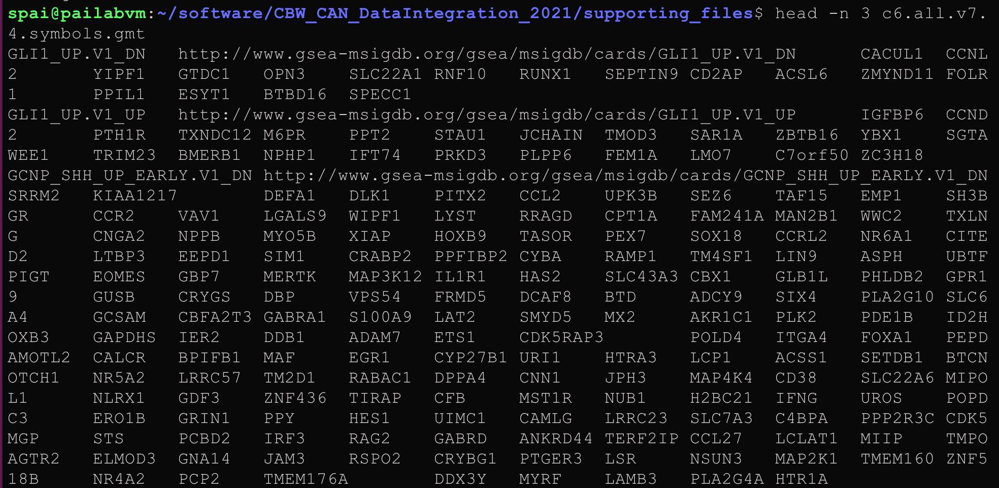

# Lab 2: Pathway-level features

In this example, we will learn how to:

* Use custom similarity metrics
* Group variables into biologically-meaningful units such as pathways, for improved interpretability

Here, we will again use breast cancer samples, and discriminate between Luminal A, Luminal B and basal-like tumours. We will limit ourselves to clinical data and gene expression data but will make the following design changes:

 * Clinical variables: A feature (or patient similarity network;PSN) will be defined at the level of selected  *variables* (e.g. age); we will define similarity as *normalized difference*. 
 * Gene expression: Features will be defined at the level of ***pathways***; i.e. each feature groups only those genes corresponding to the pathway. Similarity is defined as pairwise *Pearson correlation*.

```{r,echo=FALSE, fig.cap="Lab 2: Predictor design"}
knitr::include_graphics("images/Lab2_design.jpg")
```
 
## Setup

Let's fetch the BRCA data using `curatedTCGAData` again, this time only the gene expression data. Remember, the clinical data we automatically get in the `colData()` slot returned.

```{r,eval=TRUE}
suppressMessages(library(curatedTCGAData))
brca <- suppressMessages(
   curatedTCGAData(
	   "BRCA",c("mRNAArray"),
	   dry.run=FALSE)
	)
```

Let's look at the data. Notice that we now only have one -omic assay, gene expression measures from microarrays.

```{r,eval=TRUE}
brca
```

As before, we prepare the data. I highly recommend separating the script that prepares the data from the one running the predictor for improved management, readability and debuggability.

```{r,eval=TRUE}
source("prepare_data.R")
brca <- prepareDataForCBW(brca, setBinary=TRUE)
```

## Rules to create features (patient similarity networks)
Load the `netDx` package and initialize the `groupList` object, where we will store our grouping rules.
Recall that `groupList` is a list-of-lists, with the top tier containing data layer names, and that the layer names must match `names(assays(brca))` or whatever your `MultiAssayExperiment` object is called.

```{r,eval=TRUE}
suppressWarnings(suppressMessages(require(netDx)))
groupList <- list()
```

### RNA: Pathway features

Let's group genes into *pathway-level features*, i.e. instead of one PSN for transcriptomic data, we create one PSN for each *pathway*. So if you had a pathway set with 2,000 curated pathways, **this would generate 2,000 input PSN**. 

**NOTE:** This design changes model-building time to several hours, so avoid large gene sets (e.g. the full set of ~44,000 Gene Ontology terms, or even ~29,000 GO Biological Process terms). A reasonable start is a compilation of pathways from all curated pathway databases, as in below. 
Whicever list you use can be pruned by constraining the min/max number of genes in a set, but the size is something to keep in mind.

There are two ways of providing pathway data to netDx:
1. You can **download** a compilation of pathways from curated databases using the `fetchPathwayDefinitions()` function in netDx, like so:
```{r,eval=TRUE}
x <- fetchPathwayDefinitions("March",2021)
x
```

The above pathway set was downloaded from [download.baderlab.org/EM_Genesets](http://download.baderlab.org/EM_Genesets), which is a good resource for routinely-updated curated pathway definitions. Pathways are compiled from Reactome, Panther, NCI, MSigDB, etc., [REF], and data is contained in [GMT format](https://software.broadinstitute.org/cancer/software/gsea/wiki/index.php/Data_formats#GMT:_Gene_Matrix_Transposed_file_format_.28.2A.gmt.29), a common format to represent gene-sets, such as pathways. You can see from the value of `x` that the file isn't downloaded to our working directory, but rather is stored in a BioConductor-specific location for files (file cache), using the [BiocFileCache](https://www.bioconductor.org/packages/release/bioc/html/BiocFileCache.html) class. This way if we rerun the script, BioConductor will only download the file again if it has changed since our last download.

Here is an example of the GMT format:

```{r,echo=FALSE, fig.cap="Lab 2: Predictor design"}

```

We then use `readPathways()` to read the pathways into a list format to provide the predictor with. So the full call looks like this:

```{r,eval=TRUE}
pathList <- readPathways(fetchPathwayDefinitions("March",2021))
head(pathList)
```

2. Alternatively, you can also provide a custom pathway set to netDx by reading in a GMT file, using the `readPathways()` function. In this example, I've downloaded a geneset of [pathways often dysregulated in cancer](http://www.gsea-msigdb.org/gsea/msigdb/collections.jsp#C7), set C6 from MSigDB (REF):

```{r,eval=TRUE}
#####TBA
###myGMTfile <- "supporting_files/c6.all.c7.4.symbols.gmt"
###file.exists(myGMTfile)
####x <- readPathways(myGMTfile)
###head(x)
```

For this tutorial we will limit ourselves to the first set of pathways and use `groupList` to tell netDx to group transcriptomic data using pathways. 

**NOTE: The pathway definition file should use the same identifier type as your patient data. For instance, if the genes in your transcriptomic data are represented using [HGNC symbols](https://www.genenames.org/tools/search/), then your pathway definition file must also use HGNC symbols (e.g. *ID2S*), and not a different type of identifier, such as Ensembl IDs (which look like this: *ENSG00000010404*).**


```{r,eval=TRUE}
groupList[["BRCA_mRNAArray-20160128"]] <- pathList 
```

### Clinical: Single variables
Models often include clinical variables such as demographic or disease-related features such as age, sex, or treatment regimen. In this example, we take two variables from the sample metadata, and include create one PSN *for each variable*.  

So here, we map the following:

* `patient.age_at_initial_pathologic_diagnosis` to `age` (just shorter)
* `stage` to `STAGE`

These variables must be present in the `colData()` slot:
```{r,eval=TRUE}
pheno <- colData(brca)
head(pheno[,c("patient.age_at_initial_pathologic_diagnosis","STAGE")])
```

We now add the entry into `groupList`. The entry for `clinical` is special because netDx will look for corresponding variables in the sample metadata table, `colData()`, rather than looking for "clinical"  within `assays(brca)`.

```{r,eval=TRUE}
groupList[["clinical"]] <- list(
      age="patient.age_at_initial_pathologic_diagnosis",
	   stage="STAGE"
)
```

## Rules to create PSNs
We now tell netDx what similarity metric to use 

This is `makeNets()` just as we had seen in the previous exercise, which provides `netDx` with a custom function to generate similarity networks (i.e. features). We previously used the following code to create PSN based on Pearson correlation: 

*(Do not paste this in)*
```{r,eval=FALSE}
makePSN_NamedMatrix(..., writeProfiles=TRUE,...)`
```
We will now make a different call to `makePSN_NamedMatrix()` but this time, requesting the use of the normalized difference similarity metric. 

This is achieved by calling the following code *(Do not paste this in, either)*:
```{r,eval=FALSE}
makePSN_NamedMatrix(,..., 
	simMetric="custom", customFunc=normDiff,
	writeProfiles=FALSE)
```

`normDiff` is a function provided in the `netDx` package, but the user may define custom similarity functions in this block of code and pass those to `makePSN_NamedMatrix()`, using the `customFunc` parameters; additionally set `simMetric` to `custom`.

Other presets provided by netDx include: 

* `sim.pearscale`: Pearson correlation followed by exponential scaling; used with a vector
* `sim.eucscale`: Euclidean disance followed by exponential scaling; used with a vector
* `normDiff`: Normalized difference; used with a single variable such as age
* `avgNormDiff`: Average normalized difference; used with a vector

When we're done, this is what the `makeNets` function look like. 

*Note: I realize this may be complicated. Future versions of netDx will simplify this syntax.*

```{r,eval=TRUE}
makeNets <- function(dataList, groupList, netDir,...) {
	netList <- c() 

	# make RNA nets (Pearson correlation)
	rna <- "BRCA_mRNAArray-20160128"
	if (!is.null(groupList[[rna]])) { ## REMEMBER TO CHECK FOR NULL
		netList <- makePSN_NamedMatrix(
			dataList[[rna]],
			rownames(dataList[[rna]]),
			groupList[[rna]],
			netDir,
			verbose=FALSE,
			writeProfiles=TRUE,			## define Pearson similarity as before
			...) 
	}
	
	# make clinical nets (normalized difference)
	netList2 <- c()
	if (!is.null(groupList[["clinical"]])) {
	netList2 <- makePSN_NamedMatrix(
		dataList$clinical, 
		rownames(dataList$clinical),
		groupList[["clinical"]],netDir,
		simMetric="custom",customFunc=normDiff, ### Notice simMetric & customFunc
		writeProfiles=FALSE,
		sparsify=TRUE,
		verbose=FALSE,
		...)
	}
	netList <- c(unlist(netList),unlist(netList2))
	return(netList)
}
```

## Build predictor

Finally!
We have:

* prepared our data,
* grouped RNA by pathways (`fetchPathwayDefinitions()`, `readPathways()`),
* created two PSN using clinical variables (`groupList$clinical`), and
* defined our similarity metrics (`makeNets()`).

Now we build our predictors. For this tutorial, we use two train/test splits. For each split, we assign features a score between zero and two, and call features with score of 1+ "feature-selected".

**Realistic parameters:** When running this with your project, reasonable values are  `numSplits=10L` (10 is a good start, just to see if you get signal, 100+ if firming up for publication), `featScoreMax=10L`, `featSelCutoff=9L`.
 
```{r,eval=TRUE}
###t0 <- Sys.time()
###set.seed(42) # make results reproducible
###outDir <- paste(tempdir(),"pred_output",sep=getFileSep()) # use absolute path
###numSplits <- 2L
###model <- suppressMessages(
###   buildPredictor(
###	   dataList=brca,
###	   groupList=groupList,
###	   makeNetFunc=makeNets,
###	   outDir=outDir, 
###	   numSplits=numSplits, 
###	   featScoreMax=2L, 
###	   featSelCutoff=1L,
###	   numCores=4L
###	   )
###)
###t1 <- Sys.time()
###print(t1-t0) # time taken
```

The above settings were chosen to Let's actually load data generated by reasonable parameters, e.g. `numSplits=10L`, `featScoreMax=10L`, `featSelCutoff=9L`, generated for this tutorial:

```{r,eval=TRUE}
outFile <- sprintf("%s/CBW_Lab2_full.rda",tempdir())
lnames <- load("/home/spai/data/brca_binary_pathways.rda")
#download.file("https://github.com/RealPaiLab/CBW_CAN_DataIntegration_2021/raw/master/supporting_files/brca_pathways_full.rda", 
#	#destfile=outFile)
#lnames <- load(outFile)
```
We can see the objects in the file using `lnames()`. 

## Examine output
As before, we get model results, using `getResults()` from our helper script, `helper.R`. We define sel

```{r,eval=TRUE}
source("helper.R")
results <- getResults(brca,model_full,
	featureSelCutoff=9L,
	featureSelPct=0.9)
```

Let's examine our confusion matrix:
```{r,eval=TRUE}
confMat <- confusionMatrix(model_full)
```

This function returns the confusion matrix for each split, as well as the average shown in the image above:

```{r,eval=TRUE}
summary(confMat)
```

## Visualize top pathways in Cytoscape

We will now visualize top-scoring pathways using the Cytoscape visualization EnrichmentMap. Recall from the XXX module that an EnrichmentMap is a network visualization of related gene-sets, where each node is a pathway and edges connect similar pathways. 

Let us say we only want to see pathways that scored in some target range for "most" of the trials; i.e. consistently high-scoring pathways.
We quantify this by asking only for features that score [`EMapMinScore`,`EMapMaxScore`] for `EMapPctPass` fraction of trials.

Here we ask for features scoring 7+ out of 10 for at least 70% of the train/test splits. 

```{r,eval=TRUE}
emap <- makeInputForEnrichmentMap (
	model=model_full,
	results=results,
	pathwayList=pathList,
	EMapMinScore=7L, 
	EMapMaxSore=10L,
	EMapPctPass=0.7,
	outDir="/home/spai/data"
)
```
This call will return paths to the output files, which you need to now download from AWS to your personal computer:

```{r,eval=TRUE}
emap
```

Download these now by opening your web browser to: http://<your student instance>. 

Now let's use Cytoscape to create an EnrichmentMap.

1. Go to Apps > EnrichmentMap.
2. In the dialog box, click "**+**" on the top-left.
3. In the right hand panel that opens, select "Analysis type: Generic/gProfiler/Enrichr"
4. Change "GMT:" to the file you just downloaded: e.g. the file for Luminal.A. 
5. In the bottom panel, click "Show Advanced Options".
6. Bottom panel, right: set cutoff = 0.05; metric = Jaccard.
7. Click "Build."

You should now see a network like this

**INSERT NETWORK IMAGE**

```{r,eval=TRUE}
###plotEmap(gmtFiles[[1]],nodeAttrFiles[[1]],
###         groupClusters=TRUE, hideNodeLabels=TRUE)
```


## sessionInfo
```{r,eval=TRUE}
sessionInfo()
```
