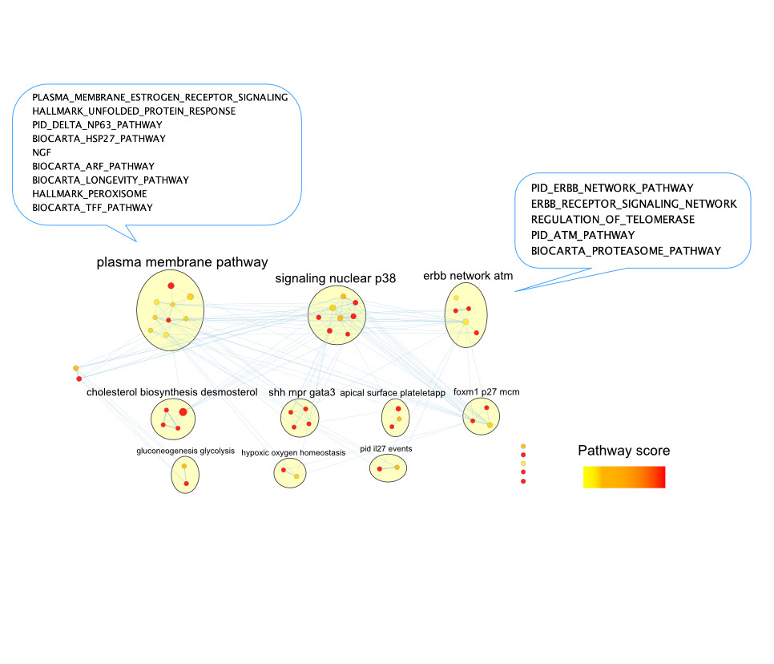

--- 
title: "Multi-modal Data Integration"
subtitle: "CBW Cancer Analysis Workshop"
author: "Instructor: Shraddha Pai"
date: "last modified `r Sys.Date()`"
site: bookdown::bookdown_site
output: bookdown::gitbook
documentclass: book
bibliography: [book.bib]
biblio-style: nature
csl: nature.csl
link-citations: yes
github-repo: rstudio/bookdown-demo
favicon: images/favicon.ico
description: "Covers patient classification using multi-modal data integration"
---

# 

<!--chapter:end:index.Rmd-->

# Introduction

This book contains lab exercises for Module 11: Multi-modal Data Integration, as part of the [Canadian Bioinformatics Workshop Cancer Analysis (CAN) Workshop](https://bioinformatics.ca/workshops/2021-cancer-analysis/).

## Course materials

You can download course slides here **LINK TBA**

We will have two lab exercises, where we build patient classifiers using multi-modal data integration, using netDx [@Pai2019-iu; @Pai2021-um]. 

## Data

<style>
p.caption {
  font-size: 0.6em;
}
</style>

For both lab exercises, we will use multi-modal breast cancer data from The Cancer Genome Atlas [@noauthor_2012-nc], and classify tumours by molecular subtypes originally defined using gene expression profiles. 

In particular, we will focus on classifying tumours as being of either *Luminal A*, *Luminal B*, or *Basal-like* subtypes. These subtypes vary by prevalence, prognosis for survival and relapse, activated cellular signaling pathways, immunohistochemical markers and treatment options [@Yersal2014-km]. 

```{r,echo=FALSE,fig.cap="Reprinted from [Intrinsic and Molecular Subtypes of Breast Cancer](https://app.biorender.com/biorender-templates/figures/5f15ea4438c5ef002876ab4b/t-5f872409fb2c3900a82e109e-intrinsic-and-molecular-subtypes-of-breast-cancer), by BioRender, October 2020, Copyright 2021 by BioRender."}
knitr::include_graphics("images/intrinsic-and-molecular-subtypes-of-breast-cancer.png")
```

This dataset was selected because it has characteristics of a common use cancer in cancer genomics:

* There are pre-defined subtypes discovered using class discovery approaches (unsupervised methods such as clustering) OR defined by the clinical problem
* Subtypes are correlated with differences in clinical outcome and choice of treatment 
* For the purposes of this lab, it is instructive to use subtypes with known cellular signaling pathways


## Labs

### LAB 1: A gentle introduction 

We will classify breast tumours as being one of three subtypes: Luminal A, Luminal B, and Basal-like. For this we will build a **three-way classifier** by integrating four types of -omic data: gene expression, miRNA, DNA methylation and proteomics. The design will be simple, using a single patient similarity network (feature) created from each layer. Similarity will be defined as pairwise Pearson correlation of profiles. Each network will use all measures from a given -omic data type (no filtering or grouping). 

```{r,eval=TRUE, echo=FALSE}
knitr::include_graphics("images/Lab1_design.jpg")
```

### LAB 2: Pathway features & custom similarity metrics

We will build a **binary classifier** of breast tumour subtype using gene expression and clinical data, but will use a slightly more complex design. We will define features at the *pathway level* for gene expression, so we can score pathways by their ability to predict outcome. With clinical data, we will define features at the level of *individual clinical variables* (e.g. age). We will also introduce the idea of using custom similarity metrics.

```{r,eval=TRUE,echo=FALSE}
knitr::include_graphics("images/Lab2_design.jpg")
```

## Instructions
* Labs will use **Rstudio**.
* Each lab will be provided as blocks of R code you will copy-paste into Rstudio to follow the building of the predictor. Code blocks to be pasted will be in yellow like so.

```{r,class.source="codeblock",eval=FALSE}
x <- 5
```
If you hover your mouse over the block, you should see a little clipboard icon. Clicking on that icon will allow you to copy the block in one shot. I would use that.

In each case, the result of executing a code block is shown directly after the code, in grey blocks like the one below. These are not intended to be pasted in. 

```{r,eval=FALSE}
5
```

Sometimes we show "pseudocode" or conceptual code blocks; these will also be in grey. None of these are intended to be pasted in.
```{r,eval=FALSE}
# do not paste me in!
loop_over (all my patients){
    do something useful;
}
```

That's about it! 

Let's go!


<!--chapter:end:01-Introduction.Rmd-->

# Module 11 Lab 1: Three-way classifier from four genomic layers

**This work is licensed under a [Creative Commons Attribution-ShareAlike 3.0 Unported License](http://creativecommons.org/licenses/by-sa/3.0/deed.en_US). This means that you are able to copy, share and modify the work, as long as the result is distributed under the same license.**

## Introduction

In this lab we will build a predictor to classify three different types of breast tumours, two of a luminal subtype (Luminal A and Luminal B), and one of a basal subtype. 

For this we will use data from the  The Cancer Genome Atlas, and will integrate four types of -omic data: 

* gene expression from Agilent mRNA microarrays
* DNA methylation (Illumina HumanMethylation 27K microarrays))
* proteomic measures from reverse-phase protein arrays, and 
* miRNA sequencing 

```{r, fig.cap="Lab 1 design: We will integrate four layers of genomic data. Each layer will be converted into a single patient similarity network using Pearson correlation for pairwise similarity. ",echo=FALSE}
knitr::include_graphics("images/Lab1_design.jpg")
```

## Get and prepare data

In this example, we use curated multi-modal data from The Cancer Genome Atlas, gotten from the BioConductor `curatedTCGAData` package. Data for all cancer types profiled in TCGA are available through this package; [see this tutorial for details](https://bioconductor.org/packages/release/data/experiment/vignettes/curatedTCGAData/inst/doc/curatedTCGAData.html). 

```{r, class.source="codeblock",eval=TRUE}
suppressMessages(library(curatedTCGAData))
```

Let's take a look at the available data for breast cancer, without downloading any (set `dry.run=TRUE`). 
Note that the new release of BioConductor (3.13) actually allows users to fetch one of two versions of TCGA data. 

```{r, class.source="codeblock",eval=TRUE}
curatedTCGAData(diseaseCode="BRCA", assays="*",dry.run=TRUE)
```
Now let's actually download the data, getting just the four layers we need:

```{r, class.source="codeblock",eval=TRUE}
brca <- suppressMessages(curatedTCGAData("BRCA",
                                         c("mRNAArray","Methylation_methyl27", 
										 "RPPAArray","miRNASeqGene"),
                                         dry.run=FALSE))
```

This call returns a `MultiAssayExperiment` object. Recall that this is a container for storing multiple assays performed on the same set of samples. [See this tutorial](https://bioconductor.org/packages/release/bioc/vignettes/MultiAssayExperiment/inst/doc/QuickStartMultiAssay.html) to learn more.


Let's briefly explore the `brca` `MultiAssayExperiment` object.

```{r, class.source="codeblock",eval=TRUE}
brca
```

`assays()` returns a `list` with all -omic data associated with this object.  

```{r, class.source="codeblock",eval=TRUE}
summary(assays(brca))
```
`names()` shows the datatypes in each slot of `assays()`:

```{r, class.source="codeblock",eval=TRUE}
names(assays(brca))
```

So miRNA data is in slot 1, gene expression in slot 2, etc., 

We can subset the data to see what it looks like. Let's do that for the miRNA data, looking at just the first five measures

```{r, class.source="codeblock",eval=TRUE}
mir <- assays(brca)[["BRCA_miRNASeqGene-20160128"]]
head(mir[,1:5])
```

Patient metadata is contained in the `colData()` slot. Rows contain data for each patient and columns contain measures such as clinical characteristics:

```{r, class.source="codeblock",eval=TRUE}
pheno <- colData(brca)
colnames(pheno)[1:20]
head(pheno[,1:5])
```

This next code block prepares the TCGA data. This includes:

* removing duplicate samples
* reformatting patient IDs (e.g. removing spaces and hyphens)
* creating an `ID` column in `colData(brca)`, which contains unique patient IDs
* creating a `STATUS` column in `colData(brca)` which contains the patient labels (i.e what we want netDx to classify). 


In practice you would prepare the dataset once and save it to file, then separately load it before running netDx; i.e. decouple data processing and running the predictor. The data processing code has been moved into a supporting file, `prepare_data.R`. You can explore it after the lab to see how some things are achieved (e.g. removing duplicate samples). For now, let's just run it.

```{r, class.source="codeblock",eval=TRUE}
source("prepare_data.R")
brca <- prepareDataForCBW(brca)
```

Notice that we now have `ID` and `STATUS` columns in the sample metadata table. 

```{block,type="rmd-caution"}

netDx requires `ID` and `STATUS` columns in `colData(...)`. Be sure to define these in the code you use to prepare the data. Otherwise the function to build the predictor will return an error.

```

```{r, class.source="codeblock",eval=TRUE}
pheno <- colData(brca)
head(pheno[,c("ID","STATUS")])
table(pheno$STATUS,useNA="always")  # good practice: useNA="always" shows missing values
```

## Create feature design rules

Now let's set up the data for input to netDx. 

netDx allows the user to define how data is converted into patient similarity networks (or PSNs), which are the features that go into the model. This is done specifically by telling the model how to:

* **group** different types of data and 
* **define similarity** for each of these (e.g. Pearson correlation, normalized difference, etc.,).

The relevant input parameters are:

* `groupList`: sets of input data that would correspond to individual networks (e.g. genes grouped into pathways)
* `makeNets()`: an R function telling netDx what similarity metric to use for each data layer

Let's start by loading the `netDx` package.


```{r, class.source="codeblock",eval=TRUE}
suppressWarnings(suppressMessages(require(netDx)))
```

Let's set up each of the input arguments one by one.

### groupList
**What is this:** `groupList` tells netDx how to group measures within a layer, to generate a PSN. Measures could be individual genes, proteins, CpG bases (in DNA methylation data), clinical variables, etc., 

In this simple example we just create a single PSN for each datatype, containing all measures from that datatype.


```{r, class.source="codeblock",eval=TRUE}
expr <- assays(brca)
groupList <- list()
for (k in 1:length(expr)) {	# loop over all layers
	cur <- expr[[k]]; nm <- names(expr)[k]

	# all measures from this layer go into our single PSN
	groupList[[nm]] <- list(nm=rownames(cur)) 

	# assign same layer name as in input data
	names(groupList[[nm]])[1] <- nm;
}
```
Notice that `groupList` is a two tiered list, or list-of-lists. The first tier is for each data layers, with names matching those in `assays(brca)`. The second tier contains all the PSNs we want to make for that layer. In this lab exercise we create only one PSN per data layer, using all the measures from an -omic assay. e.g. One PSN based on similarity across entire transcriptome, one for methylome, etc.,). So in this lab exercise, the inner tier simply contains one entry, with all measures for the given layer. 

This design will get more interesting in Lab 2, when we create pathway-level features. 

Let's take a look at `groupList`. Here is the first tier:


```{r, class.source="codeblock",eval=TRUE}
summary(groupList)
```

And the second tier:


```{r, class.source="codeblock",eval=TRUE}
names(groupList[["BRCA_mRNAArray-20160128"]])
length(groupList[["BRCA_mRNAArray-20160128"]][[1]])
head(groupList[["BRCA_mRNAArray-20160128"]][[1]])
```

### Define patient similarity for each network
The `makeNets` function tells the predictor how to create networks from provided input data.

This function requires `dataList`,`groupList`, and `netDir` as input variables. The residual `...` parameter is to pass additional variables to `makePSN_NamedMatrix()`, notably `numCores` (number of parallel jobs).

netDx requires that this function have:

* `dataList`,`groupList`, and `netDir` as input variables. The residual `...` parameter is to pass additional variables to `makePSN_NamedMatrix()`, notably number of cores for parallel processing (`numCores`). 


```{r, class.source="codeblock", eval=TRUE}
makeNets <- function(dataList, groupList, netDir,...) {
	netList <- c() # initialize before is.null() check
	
	layerNames <- c("BRCA_miRNASeqGene-20160128",
		"BRCA_mRNAArray-20160128",
		"BRCA_RPPAArray-20160128",
		"BRCA_Methylation_methyl27-20160128")
	
	for (nm in layerNames){  			## for each layer
		if (!is.null(groupList[[nm]])){ ## must check for null for each layer
			netList_cur <- makePSN_NamedMatrix(
				dataList[[nm]],
				rownames(dataList[[nm]]),	## names of measures (e.g. genes, CpGs)
				groupList[[nm]],			## how to group measures in that layer
				netDir,						## leave this as-is, netDx will figure out where this is.
				verbose=FALSE, 			
				writeProfiles=TRUE,   		## use Pearson correlation-based similarity
				...
				)

			netList <- c(netList,netList_cur)	## just leave this in
		}
	}
	return(unlist(netList))	## just leave this in 
}

```

```{block,type="rmd-design"}
While netDx provides a high degree of flexibility in achieving your design of choice, it is up to the user to ensure that the design, i.e. choice of similarity metrics and variable groupings, is appropriate for your application. Domain knowledge is almost likely required for good design. 
```

## Build predictor

Finally we call the function that runs the netDx predictor. We provide:

* patient data  (`dataList`)
* grouping rules (`groupList`)
* function to create PSN from data, includes choice of similarity metric (`makeNetFunc`)
* number of train/test splits over which to collect feature scores and average performance: `numSplits`, 
* maximum score for features in one round of feature selection  (`featScoreMax`, set to 10)
* threshold to call feature-selected networks for each train/test split (`featSelCutoff`); only features scoring this value or higher will be used to classify test patients,
* number of cores to use for parallel processing (`numCores`).

The call below runs 2 train/test splits, to be able to run fast. 
Within each split, it:

* splits data into train/test using the default split of 80:20 (`trainProp=0.8`)
* score networks between 0 to 2 (i.e. `featScoreMax=2L`)
* uses networks that score >=1 out of 2 (`featSelCutoff=1L`) to classify test samples for that split.

```{block,type="rmd-design"}
These are unrealistically low values set so the example will run fast. In practice a good starting point is `featScoreMax=10`, `featSelCutoff=9` and `numSplits=10L`, but these parameters depend on the sample sizes in the dataset and heterogeneity of the samples.
``` 
 
```{r lab1-buildpredictor ,class.source="codeblock",eval=TRUE}
set.seed(42) # make results reproducible
outDir <- paste(tempdir(),randAlphanumString(),
	"pred_output",sep=getFileSep())
if (file.exists(outDir)) unlink(outDir,recursive=TRUE)
t0 <- Sys.time()
model <- suppressMessages(buildPredictor(
	dataList=brca,			## your data
	groupList=groupList,	## grouping strategy
	makeNetFunc=makeNets,	## function to build PSNs
	outDir=outDir, 			## output directory
	trainProp=0.8,			## pct of samples to use to train model in
							## each split
	numSplits=2L,			## number of train/test splits
  	featSelCutoff=1L,		## threshold for calling something
							## feature-selected
  	featScoreMax=2L,		## max score for feature selection
    numCores=4L,			## set higher for parallelizing
  	debugMode=FALSE,
  	keepAllData=FALSE,	## set to TRUE for debugging or low-level files used by the predictor
    logging="none"
  ))
t1 <- Sys.time()
print(t1-t0)
```

## Examine results
The results are stored in the list object returned by the `buildPredictor()` call.
This list contains:

* `inputNets`: all input networks that the model started with. 
* `Split<i>`: results for each train-test split (list)
  * `predictions`: real and predicted labels for test patients 
  * `accuracy`: percent accuracy of predictions
  * `featureScores`: feature scores for each label (list with `g` entries, where `g` is number of patient labels). Each entry contains the feature selection scores for the corresponding label.
  * `featureSelected`: features passing feature selection in a split (list of length `g`, with one entry per label)


```{r, class.source="codeblock",eval=TRUE}
summary(model)
summary(model$Split1)
```

### Get model results
Now we get model output, including performance for various train/test splits and consistently high-scoring features. We've actually generated results using more real-world parameters, including 10 train/test splits and a greater dynamic range for feature scores (`featScoreMax=10L` and `featSelCutoff=9L`).

Let's load those for a better experience exploring results:

```{r, class.source="codeblock",eval=TRUE}
outFile <- sprintf("%s/CBW_Lab1_full.rda",tempdir())
download.file("https://github.com/RealPaiLab/CBW_CAN_DataIntegration_2021/raw/master/supporting_files/Lab1_files/Lab1_10splits.rda",
	destfile=outFile)
lnames <- load(outFile)
```

`helper.R` contains convenience functions to do this, which will be integrated into upcoming versions of netDx. 

In the function below, we define top-scoring features as those which score at least 2 in at least half of the train/test splits


```{r lab1-getresults,class.source="codeblock",eval=TRUE}
source("helper.R")
results <- getResults(brca,model_full,featureSelCutoff=9L,
	featureSelPct=0.9)
```

`results` contains `performance`, `selectedFeatures` for each patient label, and the table of feature `scores`.

```{r, class.source="codeblock",eval=TRUE}
summary(results)
```

Look at the performance:
```{r, class.source="codeblock",eval=TRUE}
results$performance
```

Look at feature scores for all labels, across all train-test splits:

```{r, class.source="codeblock", eval=TRUE}
results$featureScores
```

Let's examine our confusion matrix:
```{r, class.source="codeblock",eval=TRUE}
confMat <- confusionMatrix(model_full)
```

*Note: Rows of this matrix don't add up to 100% because the matrix is an average of the confusion matrices from all of the train/test splits.*

And here are selected features, which are those scoring 2 out of 2 in at least half of the splits. This threshold is simply for illustration. In practice we would run at least 10 train/test splits (ideally 100+), and look for features that score 7+ out of 10 in >70% splits.

```{r, class.source="codeblock",eval=TRUE}
results$selectedFeatures
```

We finally get the integrated PSN and visualize it using a tSNE plot:

```{r, class.source="codeblock",fig.width=8,fig.height=8, eval=TRUE}
psnFile <- sprintf("%s/psn.rda",tempdir())
download.file("https://github.com/RealPaiLab/CBW_CAN_DataIntegration_2021/raw/master/supporting_files/Lab1_files/Lab1_PSN.rda",
	destfile=outFile)
load(outFile)
#psn <- getPSN(brca,groupList_full,makeNets_full,results$selectedFeatures)

tsne <- tSNEPlotter(
	psn$patientSimNetwork_unpruned, 
	colData(brca)
	)
```

## Conclusion

Congratulations! You have successfully classified three types of tumours by integrating four different -omic layers (transcriptomic, methylomic,proteomic and miRNA). 

```{block,type="rmd-tip"}
 We end this tutorial with a call to `sessionInfo()` which prints the complete environment information for your R session. This is standard output that should be reported to R package managers when you write in with a question, particularly if reporting an error or bug. Sometimes a particular underlying dependency package may be the cause of an error, or you may need to upgrade to a newer version of the package. By including this info in an email, you will allow the other person to better solve your issue. 

```

## sessionInfo
```{r}
sessionInfo()
```

<!--chapter:end:02-BuildPredictor.Rmd-->

# Module 11 Lab 2: Pathway-level features

**This work is licensed under a [Creative Commons Attribution-ShareAlike 3.0 Unported License](http://creativecommons.org/licenses/by-sa/3.0/deed.en_US). This means that you are able to copy, share and modify the work, as long as the result is distributed under the same license.**

## Introduction
In this example, we will learn how to:

* Use custom similarity metrics
* Group variables into biologically-meaningful units such as pathways, for improved interpretability

Here, we will again use breast cancer samples, and discriminate between Luminal A, Luminal B and basal-like tumours. We will limit ourselves to clinical data and gene expression data but will make the following design changes:

 * Clinical variables: A feature (or patient similarity network;PSN) will be defined at the level of selected  *variables* (e.g. age); we will define similarity as *normalized difference*. 
 * Gene expression: Features will be defined at the level of ***pathways***; i.e. each feature groups only those genes corresponding to the pathway. Similarity is defined as pairwise *Pearson correlation*.

```{r, class.source="codeblock",echo=FALSE, fig.cap="Lab 2 design: We will integrate clinical and gene expression data. Each layer will be converted into a single patient similarity network using Pearson correlation for pairwise similarity.", echo=FALSE}
knitr::include_graphics("images/Lab2_design.jpg")
```

```{block type="rmd-design"}
 1. In practice I recommend running a predictor design with 2-3 different sets of pathway definitions, and comparing the predictive pathway themes. For instance, it could be useful to compare results from using all curated pathways, to just domain-specific ones.  
 Feature design is something of an art, and the choice of pathways depends on what your goals with building the predictor are. Are you looking to prioritize a known set of biological processes or interested in general discovery? These are tradeoffs. 
 At the very least I would recommend running with all curated pathways as a baseline, because you may generate novel hypotheses.  

 2. Note that while in this design we group gene expression measures into pathways, the same design can be used to group other types of data based on prior knowledge. For instance, measures from imaging data could be grouped by prior knowledge of correlated networks of regions of interest subserving specific functions. 
 
 ```
 
## Get and prepare data

Let's fetch the BRCA data using `curatedTCGAData` again, this time only the gene expression data. Remember, the clinical data we automatically get in the `colData()` slot returned.


```{r, class.source="codeblock", class.source="codeblock",eval=TRUE}
suppressMessages(library(curatedTCGAData))
brca <- suppressMessages(
   curatedTCGAData(
	   "BRCA",c("mRNAArray"),
	   dry.run=FALSE)
	)
```

Let's look at the data. Notice that we now only have one -omic assay, gene expression measures from microarrays.

```{r, class.source="codeblock",eval=TRUE}
brca
```

As before, we prepare the data. I highly recommend separating the script that prepares the data from the one running the predictor for improved management, readability and debuggability.

```{r, class.source="codeblock",eval=TRUE}
source("prepare_data.R")
brca <- prepareDataForCBW(brca, setBinary=TRUE)
```

## Create feature design rules
Load the `netDx` package and initialize the `groupList` object, where we will store our grouping rules.
Recall that `groupList` is a list-of-lists, with the top tier containing data layer names, and that the layer names must match `names(assays(brca))` or whatever your `MultiAssayExperiment` object is called.

```{r, class.source="codeblock",eval=TRUE}
suppressWarnings(suppressMessages(require(netDx)))
groupList <- list()
```

### RNA: Pathway features

Let's group genes into *pathway-level features*, i.e. instead of one PSN for transcriptomic data, we create one PSN for each *pathway*. So if you had a pathway set with 2,000 curated pathways, **this would generate 2,000 input PSN**. 


```{block,type="rmd-caution"}
This design changes model-building time to several hours, so avoid large gene sets (e.g. the full set of ~44,000 Gene Ontology terms, or even ~29,000 GO Biological Process terms). A reasonable start is a compilation of pathways from all curated pathway databases, as in below. 
Whichever list you use can be pruned by constraining the min/max number of genes in a set, but the size is something to keep in mind.
```

There are two ways of providing pathway data to netDx:
1. You can **download** a compilation of pathways from curated databases using the `fetchPathwayDefinitions()` function in netDx, like so:
```{r, class.source="codeblock",eval=TRUE}
x <- fetchPathwayDefinitions("March",2021)
x
```

The above pathway set was downloaded from [download.baderlab.org/EM_Genesets](http://download.baderlab.org/EM_Genesets), which is a good resource for routinely-updated curated pathway definitions. Pathways are compiled from Reactome, Panther, NCI, MSigDB, etc., [@Merico2010-nc], and data is contained in [GMT format](https://software.broadinstitute.org/cancer/software/gsea/wiki/index.php/Data_formats#GMT:_Gene_Matrix_Transposed_file_format_.28.2A.gmt.29), a common format to represent gene-sets, such as pathways. You can see from the value of `x` that the file isn't downloaded to our working directory, but rather is stored in a BioConductor-specific location for files (file cache), using the [BiocFileCache](https://www.bioconductor.org/packages/release/bioc/html/BiocFileCache.html) class. This way if we rerun the script, BioConductor will only download the file again if it has changed since our last download.

Here is an example of the GMT format:

```{r, class.source="codeblock",echo=FALSE, fig.cap="Lab 2: Example of GMT file format."}
knitr::include_graphics("images/GMT_screenshot.png")
```

We then use `readPathways()` to read the pathways into a list format to provide the predictor with. So the full call looks like this:

```{r, class.source="codeblock",eval=TRUE}
pathList <- readPathways(fetchPathwayDefinitions("March",2021))
head(pathList)
```

1. Alternatively, you can also provide a custom pathway set to netDx by reading in a GMT file, using the `readPathways()` function. In this example, I've downloaded a geneset of [pathways often dysregulated in cancer](http://www.gsea-msigdb.org/gsea/msigdb/collections.jsp#C7), set C6 from MSigDB [@Subramanian2005-am]:

```{r, class.source="codeblock",eval=TRUE}
gmtFile <- sprintf("%s2/cancer_pathways.gmt",tempdir())
if (!file.exists(sprintf("%s2",tempdir()))) {
	dir.create(sprintf("%s2",tempdir()))
}
download.file("https://raw.githubusercontent.com/RealPaiLab/CBW_CAN_DataIntegration_2021/master/supporting_files/c6.all.v7.4.symbols.gmt",gmtFile)
x <- readPathways(gmtFile)
x[1:3]
```

For this tutorial we will limit ourselves to the first set of pathways and use `groupList` to tell netDx to group transcriptomic data using pathways. 

```{block,type="rmd-caution"}
The pathway definition file should use the same identifier type as your patient data. For instance, if the genes in your transcriptomic data are represented using [HGNC symbols](https://www.genenames.org/tools/search/), then your pathway definition file must also use HGNC symbols (e.g. *ID2S*), and not a different type of identifier, such as Ensembl IDs (which look like this: *ENSG00000010404*).
```

```{r, class.source="codeblock",eval=TRUE}
groupList[["BRCA_mRNAArray-20160128"]] <- pathList 
```

### Clinical: Single variables
Models often include clinical variables such as demographic or disease-related features such as age, sex, or treatment regimen. In this example, we take two variables from the sample metadata, and include create one PSN *for each variable*.  

So here, we map the following:

* `patient.age_at_initial_pathologic_diagnosis` to `age` (just shorter)
* `stage` to `STAGE`

These variables must be present in the `colData()` slot:
```{r, class.source="codeblock",eval=TRUE}
pheno <- colData(brca)
head(pheno[,c("patient.age_at_initial_pathologic_diagnosis","STAGE")])
```

We now add the entry into `groupList`. The entry for `clinical` is special because netDx will look for corresponding variables in the sample metadata table, `colData()`, rather than looking for "clinical"  within `assays(brca)`.

```{r, class.source="codeblock",eval=TRUE}
groupList[["clinical"]] <- list(
      age="patient.age_at_initial_pathologic_diagnosis",
	   stage="STAGE"
)
```

We now tell netDx what similarity metric to use 

This is `makeNets()` just as we had seen in the previous exercise, which provides `netDx` with a custom function to generate similarity networks (i.e. features). We previously used the following code to create PSN based on Pearson correlation: 

```{r, eval=FALSE}
makePSN_NamedMatrix(..., writeProfiles=TRUE,...)`
```
We will now make a different call to `makePSN_NamedMatrix()` but this time, requesting the use of the normalized difference similarity metric. 

This is achieved by calling the following code:
```{r, eval=FALSE}
makePSN_NamedMatrix(,..., 
	simMetric="custom", customFunc=normDiff,
	writeProfiles=FALSE)
```

`normDiff` is a function provided in the `netDx` package, but the user may define custom similarity functions in this block of code and pass those to `makePSN_NamedMatrix()`, using the `customFunc` parameters; additionally set `simMetric` to `custom`.

Other presets provided by netDx include: 

* `sim.pearscale`: Pearson correlation followed by exponential scaling; used with a vector
* `sim.eucscale`: Euclidean disance followed by exponential scaling; used with a vector
* `normDiff`: Normalized difference; used with a single variable such as age
* `avgNormDiff`: Average normalized difference; used with a vector

When we're done, this is what the `makeNets` function look like. 

*Note: I realize this may be complicated. Future versions of netDx will simplify this syntax.*

```{r, class.source="codeblock",eval=TRUE}
makeNets <- function(dataList, groupList, netDir,...) {
	netList <- c() 

	# make RNA nets (Pearson correlation)
	rna <- "BRCA_mRNAArray-20160128"
	if (!is.null(groupList[[rna]])) { ## REMEMBER TO CHECK FOR NULL
		netList <- makePSN_NamedMatrix(
			dataList[[rna]],
			rownames(dataList[[rna]]),
			groupList[[rna]],
			netDir,
			verbose=FALSE,
			writeProfiles=TRUE,			## define Pearson similarity as before
			...) 
	}
	
	# make clinical nets (normalized difference)
	netList2 <- c()
	if (!is.null(groupList[["clinical"]])) {
	netList2 <- makePSN_NamedMatrix(
		dataList$clinical, 
		rownames(dataList$clinical),
		groupList[["clinical"]],netDir,
		simMetric="custom",customFunc=normDiff, ### Notice simMetric & customFunc
		writeProfiles=FALSE,
		sparsify=TRUE,
		verbose=FALSE,
		...)
	}
	netList <- c(unlist(netList),unlist(netList2))
	return(netList)
}
```

## Build predictor

Finally!
We have:

* prepared our data,
* grouped RNA by pathways (`fetchPathwayDefinitions()`, `readPathways()`),
* created two PSN using clinical variables (`groupList$clinical`), and
* defined our similarity metrics (`makeNets()`).

Now we build our predictors. For this tutorial, we use two train/test splits. For each split, we assign features a score between zero and two, and call features with score of 1+ "feature-selected".

**Realistic parameters:** When running this with your project, reasonable values are  `numSplits=10L` (10 is a good start, just to see if you get signal, 100+ if firming up for publication), `featScoreMax=10L`, `featSelCutoff=9L`.
 
```{r lab2-buildpredictor,class.source="codeblock",eval=TRUE}
t0 <- Sys.time()
set.seed(42) # make results reproducible
outDir <- paste(sprintf("%s2",tempdir()),"pred_output",sep=getFileSep()) # use absolute path
if (file.exists(outDir)) unlink(outDir,recursive=TRUE)
numSplits <- 2L
model <- suppressMessages(
   buildPredictor(
	   dataList=brca,
	   groupList=groupList,
	   makeNetFunc=makeNets,
	   outDir=outDir, 
	   numSplits=numSplits, 
	   featScoreMax=2L, 
	   featSelCutoff=1L,
	   numCores=4L
	   )
)
t1 <- Sys.time()
print(t1-t0) # time taken
```

The above settings were chosen to Let's actually load data generated by reasonable parameters, e.g. `numSplits=10L`, `featScoreMax=10L`, `featSelCutoff=9L`, generated for this tutorial:

```{r lab2-getresults, class.source="codeblock", eval=FALSE}
outFile <- sprintf("%s2/CBW_Lab2_full.rda",tempdir())
download.file("https://github.com/RealPaiLab/CBW_CAN_DataIntegration_2021/raw/master/supporting_files/Lab2_files/brca_binary_pathways.rda",
	destfile=outFile)
lnames <- load(outFile)
```
We can see the objects in the file using `lnames()`. 

## Examine results
As before, we get model results, using `getResults()` from our helper script, `helper.R`. 

```{r, class.source="codeblock",eval=TRUE}
source("helper.R")
results <- getResults(brca,model_full,
	featureSelCutoff=9L,
	featureSelPct=0.9)
```

As this is binary classification, we get ROC and precision-recall curves (bottom panel). The average AUROC and AUPR are shown in the top panel.
Let's take a look at the average performance:
```{r,class.source="codeblock",eval=TRUE}
perf <- results$performance
round(mean(perf$splitAUROC),2)*100
round(mean(perf$splitAUPR),2)*100
round(mean(perf$splitAccuracy),2)*100
```

Notice that although the AUROC is near perfect, the accuracy is lower, at around 86%. It is important to consider several measures of predictor performance to understand the behaviour of the predictor. Let us now look at the confusion matrix:

Let's examine our confusion matrix:
```{r, class.source="codeblock",eval=TRUE}
confMat <- confusionMatrix(model_full)
```

*Note: Rows of this matrix don't add up to 100% because the matrix is an average of the confusion matrices from all of the train/test splits.*

We see that the predictor performs perfectly at classifying Luminal A tumours but does worse at classifying the residual, mainly because it often classifies other tumours as Luminal A! 

```{block, type="rmd-note"}
Particularly when there is class imbalance, i.e. one class has several-fold the number of samples than the other, predictors can achieve a baseline high accuracy by "cheating" and simply predicting all samples as being of the dominating label. e.g. if you have 99:1 class imbalance of two classes A and B, the predictor can achieve 99% accuracy simply by calling all samples of type "A"! 

In practice, class imbalance should be handled using suitable performance evaluation metrics and sampling proportionally for training/test sets.
```

We indeed have a class imbalance in this dataset:
```{r, class.source="codeblock",eval=TRUE}
table(colData(brca)$STATUS,useNA="always")
```

This function returns the confusion matrix for each split, as well as the average shown in the image above:

```{r, class.source="codeblock",eval=TRUE}
summary(confMat)
```

## Visualize top pathways in Cytoscape

We will now visualize top-scoring pathways using the Cytoscape visualization EnrichmentMap. Recall from Module 8 that an EnrichmentMap is a network visualization of related gene-sets, where each node is a pathway and edges connect similar pathways. 

Let us say we only want to see pathways that scored in some target range for "most" of the trials; i.e. consistently high-scoring pathways.
We quantify this by asking only for features that score [`EMapMinScore`,`EMapMaxScore`] for `EMapPctPass` fraction of trials.

Here we ask for features scoring 7+ out of 10 for at least 70% of the train/test splits. 

```{r lab2-makeemapinput ,eval=TRUE}
emap <- makeInputForEnrichmentMap (
	model=model_full,
	results=results,
	pathwayList=pathList,
	EMapMinScore=7L, 
	EMapMaxSore=10L,
	EMapPctPass=0.7,
	outDir=tempdir() 
)
```
This call will return paths to the output files, which you need to now download from AWS to your personal computer:

```{r, class.source="codeblock",eval=TRUE}
emap
```

netDx can directly generate EnrichmentMaps on a locally-installed version of Cytosape using [RCy3](https://bioconductor.org/packages/release/bioc/html/RCy3.html)[@Gustavsen2019-ec]. RCy3 allows programmatic control of Cytoscape from within R, so that visualizations such as EnrichmentMap can be programmatically created. This step needs a local copy of Cytoscape installed, so it won't work on the lab AWS instance. Try it on your laptop after the lab.

```{r, class.source="codeblock",eval=TRUE}
###plotEmap(gmtFiles[[1]],nodeAttrFiles[[1]],
###         groupClusters=TRUE, hideNodeLabels=TRUE)
```

If you wanted to look at an EnrichmentMap anyway, you can download the input files shown in the output of the `emap` object above by opening your web browser to: `http://your-student-instance` and downloading the files from there. Then build an Enrichment map using Cytoscape on your laptop as discussed earlier in the Cancer Analysis workshop. 

When you're done, the Enrichment Map for top pathways predictive of Luminal A status would look like this (below). The speech bubbles show pathway names within a couple top clusters.

```{r echo=FALSE, out.width="140%",  fig.cap="Lab 2: EnrichmentMap for top-scoring pathways predictive of Luminal A status. Nodes show pathways scoring 7+ out of 10 in over 70% of train/test splits. Edges connect pathways with shared genes. Yellow bubbles show pathway clusters, labelled by AutoAnnotate [@Kucera2016-yj]. Node fills indicate top score in 70%+ of the splits. Speech bubbles show pathways in example clusters."}

```

**Optional:** You can [download the Cytoscape session file here](https://github.com/RealPaiLab/CBW_CAN_DataIntegration_2021/raw/master/supporting_files/Lab2_files/LuminalA.cys) to see the finished result. 

```{block,type="rmd-note"}
 In practice, it can take a good portion of an hour to adjust the layout of the EnrichmentMap, and often longer to explore the contents. The automatically-generated pathway theme labels are often a reasonable first guess, but you'll find you'll often revise them upon closer inspection of the pathways within.
```

We notice that the Enrichment Map identifies several pathways known to be dysregulated in Luminal A breast tumours, including estrogen receptor-mediating signaling (PLASMA_MEMBRANE_ESTROGEN_RESPONSE_SIGNALING), p38 signaling, pathways related to genomic stability and DNA damage response (ATM), cell profileration-related signaling (ErbB signaling). 

## Outlook

```{block,type="rmd-outlook"}
Where do you go from here? That depends on your study goals and prior knowledge. Here are some possibilities:

* You may choose to focus on particular pathways for which you have targeting tools, for follow-up *in vitro* or *in vivo* experiments. 
* You may compare and contrast known effectors from novel pathways and pursue that line of research. 
* You may want to improve performance, and consider changing predictor design, including features, predictor settings, or pathway set choices.
* If you're satisfied with predictor design, you may want to [validate on an independent dataset](http://bioconductor.org/packages/release/bioc/vignettes/netDx/inst/doc/ValidateNew.html). This is something we haven't covered in this lab. 

Machine learning is very much trial-and-error, and you have to be prepared to try a variety of designs to see what works.

Future versions of netDx will include tools to help with some of this automation & also digging deeper into predictive features such as pathways, to understand what components contribute to predictive power.
```

That's it! This completes our lab exercises for Module 11.


## sessionInfo
```{r, class.source="codeblock",eval=TRUE}
sessionInfo()
```

<!--chapter:end:03-PathwayFeatures.Rmd-->

# References


<!--chapter:end:04-References.Rmd-->

