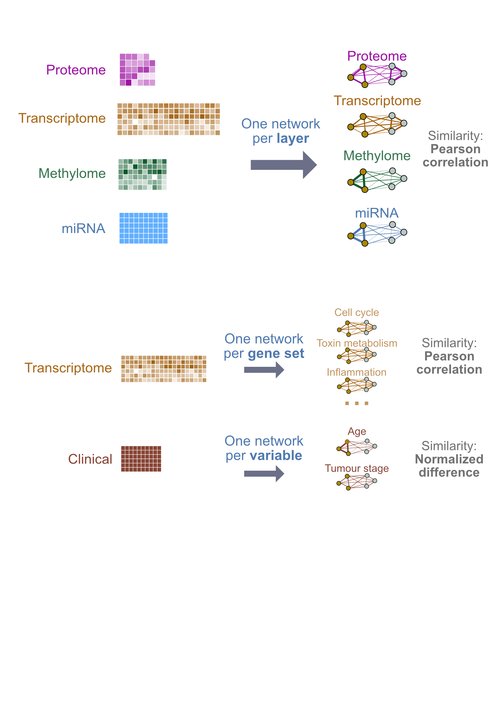
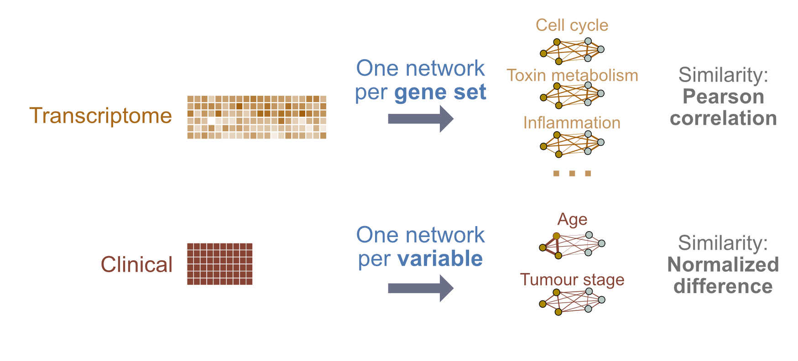

--- 
title: "Multi-modal Data Integration"
subtitle: "CBW Cancer Analysis Workshop"
author: "Instructor: Shraddha Pai"
date: "last modified `r Sys.Date()`"
site: bookdown::bookdown_site
output: bookdown::gitbook
documentclass: book
bibliography: [book.bib, packages.bib]
biblio-style: apalike
link-citations: yes
github-repo: rstudio/bookdown-demo
favicon: images/favicon.ico
description: "Covers patient classification using multi-modal data integration"
---

# Multi-modal Data Integration ( June 2021 )

This book contains lab exercises for Module 10: Multi-modal Data Integration, as part of the [Canadian Bioinformatics Workshop Cancer Analysis (CAN) Module](https://bioinformatics.ca/workshops/2021-cancer-analysis/).

## Course materials

You can download course slides here **LINK TBA**

We will have two lab exercises, where we build patient classifiers using multi-modal data integration, using netDx **ADD REFERENCES**.

### LAB 1: A gentle introduction 

We will classify breast tumours as being one of three subtypes: Luminal A, Luminal B, and Basal-like. For this we will build a **three-way classifier** by integrating four types of -omic data: gene expression, miRNA, DNA methylation and proteomics. The design will be simple, using a single patient similarity network (feature) created from each layer. Similarity will be defined as pairwise Pearson correlation of profiles. Each network will use all measures from a given -omic data type (no filtering or grouping). 

```{r,eval=TRUE, out.width="50%",echo=FALSE}

```

### LAB 2: Pathway features & custom similarity metrics

We will build a **binary classifier** of breast tumour subtype using gene expression and clinical data, but will use a slightly more complex design. We will define features at the *pathway level* for gene expression, so we can score pathways by their ability to predict outcome. With clinical data, we will define features at the level of *individual clinical variables* (e.g. age). We will also introduce the idea of using custom similarity metrics.

```{r,eval=TRUE,out.width="50%",echo=FALSE}

```

## Instructions
* Labs will use **Rstudio**.
* The lab will be provided as blocks of R code you will copy-paste into Rstudio to follow the building of the predictor. Code blocks to be pasted will be in yellow like so.

```{r,class.source="codeblock",eval=FALSE}
x <- 5
```
If you hover your mouse over the block, you should see a little clipboard icon. Clicking on that icon will allow you to copy the block in one shot. I would use that.

In each case, the result of executing a code block is shown directly after the code, in grey blocks like the one below. These are not intended to be pasted in. 

```{r,eval=FALSE}
5
```

Sometimes we show "pseudocode" or conceptual code blocks; these will also be in grey. None of these are intended to be pasted in.
```{r,eval=FALSE}
# do not paste me in!
loop_over (all my patients){
    do something useful;
}
```

That's about it! Let's go!

