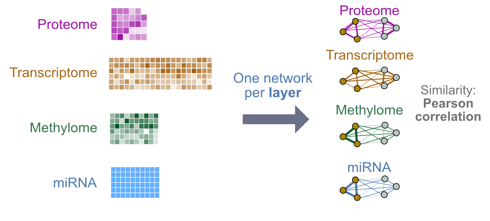

--- 
title: "Multi-modal Data Integration"
subtitle: "CBW Cancer Analysis Workshop"
author: "Instructor: Shraddha Pai"
date: "last modified `r Sys.Date()`"
site: bookdown::bookdown_site
output: bookdown::gitbook
documentclass: book
bibliography: [book.bib, packages.bib]
biblio-style: apalike
link-citations: yes
github-repo: rstudio/bookdown-demo
favicon: images/favicon.ico
description: "Covers patient classification using multi-modal data integration"
---

# Multi-modal Data Integration ( June 2021 )

This book contains lab exercises for Module 10: Multi-modal Data Integration, as part of the [Canadian Bioinformatics Workshop Cancer Analysis (CAN) Module](https://bioinformatics.ca/workshops/2021-cancer-analysis/).

You can download course slides here **ADD LINK**

We will have two lab exercises, where we build patient classifiers using multi-modal data integration, using netDx **ADD REFERENCES**.

### LAB 1: Gentle introduction 

We will classify breast tumours as being one of three subtypes: Luminal A, Luminal B, and Basal-like. For this we will build a **three-way classifier** using four types of -omic data: gene expression, miRNA, DNA methylation and proteomics. The design will be simple, using a single patient similarity network (feature) created from each layer. Similarity will be defined as pairwise Pearson correlation of profiles. Each network will use all measures from a given -omic data type (no filtering or grouping). 

```{r,eval=TRUE, out.width="50%"}

```

### LAB 2: Pathway features:

We will build a **binary classifier** of breast tumour subtype using gene expression and clinical data, but will use a slightly more complex design. We will define features at the *pathway level* for gene expression, so we can score pathways by their ability to predict outcome. With clinical data, we will define features at the level of *individual clinical variables* (e.g. age). We will also introduce the idea of using custom similarity metrics.

```{r,eval=TRUE,out.width="50%"}
knitr::include_graphics("images/Lab2_design.jpg")
```

Labs will use **Rstudio**.

Let's go!